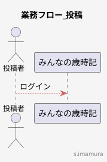

# 業務フロー図

### 投稿

```plantuml
@startuml

' === ドキュメント設定 ===
right footer s.imamura
' mainframe mainframe
title 業務フロー_投稿
' left to right direction
scale max 2048 width

' === スタイル ===
skinparam {
    ' === 共通設定 ===
    shadowing false
    ' linetype ortho
    backgroundColor whitesmoke
    arrow {
        color indianRed
        thickness 0.8
        fontSize 13
    }
    title {
        FontSize 14
        ' FontColor blue
        BorderThickness 10
        BorderColor transparent
    }

    ' === 要素別設定 ===
    actor {
        fontColor black
        fontSize 12
    }
}

actor 投稿者
participant みんなの歳時記

投稿者 --> みんなの歳時記: ログイン

@enduml
```
