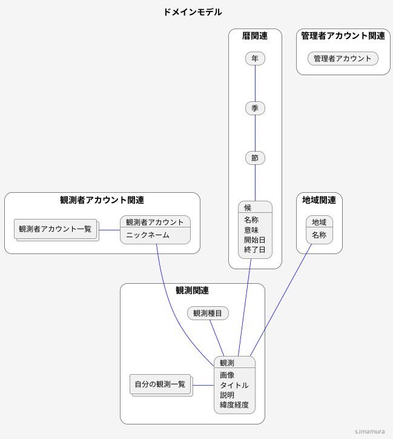

# ドメインモデル

```plantuml
@startuml


' === ドキュメント設定 ===
right footer s.imamura
' mainframe mainframe
title ドメインモデル
' left to right direction
scale max 2048 width

' === スタイル ===
skinparam {
    theme rose
    ' === 共通設定 ===
    shadowing false
    ' linetype ortho
    backgroundColor whitesmoke
    arrow {
        color blue
        thickness 0.8
        fontSize 10
    }
    title {
        FontSize 14
        ' FontColor blue
        BorderThickness 10
        BorderColor transparent
    }

    ' === 要素別設定 ===
    rectangle {
        backgroundColor white
        BorderColor #000
        RoundCorner 25
        BorderThickness 0.5
        fontColor black
        fontSize 14
    }
    collections {
        BorderColor #999999
        BorderThickness 1
        fontColor black
        fontSize 12
    }
    card {
        BorderColor #999999
        fontColor black
        BorderThickness 1
        roundCorner 20
        fontSize 12
    }
    component {
        BackgroundColor white
        BorderThickness 0.5
        BorderColor #666666
        fontColor black
        fontSize 11
    }
    storage {
        BackgroundColor white
        BorderThickness 0.5
        BorderColor #666666
        fontColor black
        fontSize 11
    }
}

' 用語
rectangle 暦関連 {
    card 候 [
        候
        --
        名称
        意味
        開始日
        終了日
    ]
    card 節
    card 季
    card 年

    ' 内部関連
    年 -- 季
    季 -- 節
    節 -- 候
}

rectangle 地域関連  {
    card 地域 [
        地域
        --
        名称
    ]
}

rectangle 観測者アカウント関連 {
    card 観測者アカウント [
        観測者アカウント
        --
        ニックネーム
    ]
    collections 観測者アカウント一覧

    ' コレクション
    観測者アカウント一覧 - 観測者アカウント
}

rectangle 観測関連 {
    card 観測 [
        観測
        --
        画像
        タイトル
        説明
        緯度経度
    ]
    collections 観測一覧 [
        自分の観測一覧
    ]
    card 観測種目

    ' コレクション
    観測一覧 - 観測

    ' 内部関連
    観測種目 -- 観測

    ' 外部関連
    候 --- 観測
    地域 --- 観測
    観測者アカウント --- 観測
}

rectangle 管理者アカウント関連 {
    card 管理者アカウント
}

@enduml
```
