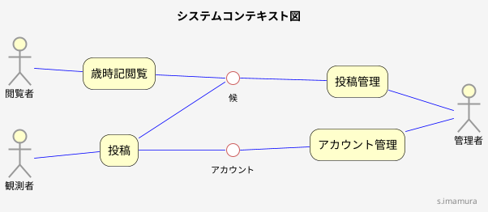

# ビジネスコンテキスト図

## 概要

```plantuml
@startuml

@startuml
' === ドキュメント設定 ===
right footer s.imamura
' mainframe mainframe
title システムコンテキスト図
left to right direction
scale max 2048 width

' === スタイル ===
skinparam {
    theme rose
    ' === 共通設定 ===
    shadowing false
    ' linetype ortho
    backgroundColor whitesmoke
    arrow {
        color blue
        thickness 0.8
        fontSize 10
    }
    title {
        FontSize 14
        ' FontColor blue
        BorderThickness 10
        BorderColor transparent
    }

    ' === 要素別設定 ===
    rectangle {
        BackgroundColor business
        BorderColor #000
        RoundCorner 25
        BorderThickness 0.6
        fontColor black
        fontSize 14
    }
    actor {
        BackgroundColor business
        BorderColor #999999
        BorderThickness 2
        fontColor black
        fontSize 12
    }
    database {
        BorderColor #999999
        fontColor black
        BorderThickness 1
        fontSize 12
    }
    interface {
        BackgroundColor white
        BorderThickness 0.5
        BorderColor indianRed
        fontColor black
        BorderThickness 1
        fontSize 11
    }
    storage {
        BackgroundColor white
        BorderThickness 0.5
        BorderColor #666666
        fontColor black
        fontSize 11
    }
}

' アクター
actor 閲覧者
actor 観測者
actor 管理者

' 業務
rectangle 投稿
rectangle 歳時記閲覧
rectangle アカウント管理
rectangle 投稿管理

' もの
interface 候
interface アカウント

' 関係
閲覧者 -- 歳時記閲覧
観測者 -- 投稿

アカウント管理 -- 管理者
投稿管理 -- 管理者


歳時記閲覧 -- 候
投稿 -- 候
投稿 -- アカウント
候 -- 投稿管理
アカウント -- アカウント管理
@enduml
```

