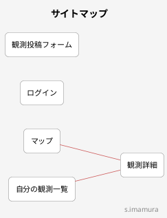

# 画面設計

## 画面一覧

### みんなの歳時記

- ログイン
- 観測投稿フォーム
- 観測一覧
  - 自分の観測一覧
  - 地域、季節による絞り込みマップ
- 観測詳細

### 管理サイト

- ログイン
- 観測者アカウント一覧
- 観測投稿一覧
- 観測投稿詳細
- 観測種目一覧

---

### サイトマップ

```plantuml
@startuml
' === ドキュメント設定 ===
right footer s.imamura
' mainframe mainframe
title サイトマップ
left to right direction
scale max 2048 width

' === スタイル ===
skinparam {
    ' === 共通設定 ===
    shadowing false
    ' linetype ortho
    backgroundColor whitesmoke
    arrow {
        color indianRed
        thickness 0.8
        fontSize 13
    }
    title {
        FontSize 14
        ' FontColor blue
        BorderThickness 10
        BorderColor transparent
    }

    ' === 要素別設定 ===
    rectangle {
        BackgroundColor white
        BorderColor #999
        RoundCorner 10
        BorderThickness 0.6
        fontColor black
        fontSize 11
    }
}

rectangle マップ
rectangle ログイン
rectangle 観測投稿フォーム
rectangle 自分の観測一覧
rectangle 観測詳細

' 関係
マップ -- 観測詳細
自分の観測一覧 -- 観測詳細

@enduml
```

